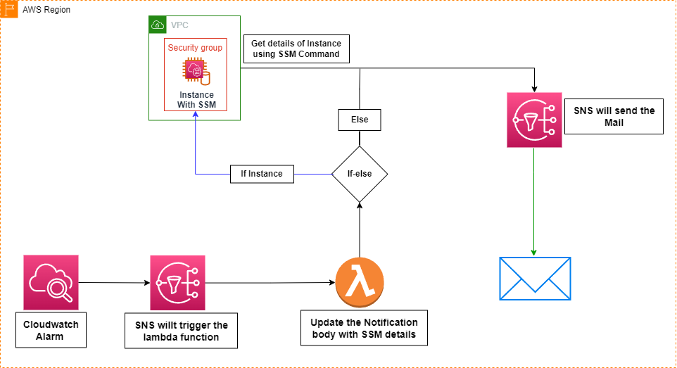

# AWS-Modified-Alarm

The AWS-Modified-Alarm is an AWS Lambda function designed to handle CloudWatch alarms triggered by Amazon EC2 instances. When an alarm is triggered, the Lambda function performs the following actions:

1. Retrieves details from the CloudWatch alarm notification.
2. Determines the instance ID and platform (Linux/Windows) associated with the alarm.
3. Executes specific commands on the EC2 instance using AWS Systems Manager (SSM) based on the type of alarm (CPU, memory, or disk).
4. Formats the command output.
5. Sends an email notification with the alarm details and command output.

## Architecture Diagram

## Prerequisites

Before setting up and configuring this Lambda function, ensure the following prerequisites are met:

- **AWS Systems Manager (SSM) Agent:** Ensure that the AWS Systems Manager (SSM) agent is pre-installed and running on your Amazon EC2 instances. This agent is required for executing commands remotely on EC2 instances.

## Setup Instructions

### 1. Set up Amazon SNS (Simple Notification Service)

- Create a new Amazon SNS topic that will be used to send email notifications when lambda publishes are triggered. Make note of the Topic ARN.

### 2. Deploy the Lambda Function

- Package and deploy the Lambda function code to your AWS environment. Ensure that the necessary IAM permissions are granted to the Lambda function to access EC2 instances and SNS topics.

### 3. Configure Environment Variables for Lambda

- In the Lambda function configuration, add the following environment variables:
  - `SNS_Topic_Arn`: The ARN of the Amazon SNS topic you created in step 1.

### 4. Increase Lambda Timeout

- Adjust the Lambda function timeout to 15 minutes.

### 5. Add the Layer

- Add a layer for the `tabulate` and `humanize` modules in the Lambda function.

### 6. Create CloudWatch Alarms

- Set up CloudWatch alarms for your Amazon EC2 instances. While providing SNS details, use the created SNS topic for triggering Lambda.

### 7. Test the Setup

- Trigger the CloudWatch alarms associated with your EC2 instances to test the Lambda function's functionality.

## Dependencies

- This Lambda function uses Python and relies on the following Python packages:
  - `boto3`: The AWS SDK for Python.
  - `humanize`: For formatting file sizes.
  - `tabulate`: For formatting tabular data.

## Test the Lambda function

Trigger the alarm associated with your Lambda function and check your email inbox for updated alarm details.

## Benefits

The CloudWatch Alarm Handler Lambda function provides the following benefits:

- **Centralized Monitoring:** Monitor multiple Amazon EC2 instances from a central location.
- **Proactive Notifications:** Receive email notifications when CloudWatch alarms are triggered, allowing prompt investigation and corrective action.
- **Scalability:** Scale the Lambda function to monitor a large number of Amazon EC2 instances.

## Conclusion

The CloudWatch Alarm Handler Lambda function is a robust tool for monitoring Amazon EC2 instances, delivering timely email notifications with detailed instance information for triggered CloudWatch alarms, considering the operating system (Windows/Linux) and alarm types (CPU, Memory, Disk)  This functionality proves instrumental in swiftly investigating the causes of alarms and promptly implementing corrective actions.

## Contributing

If you'd like to contribute to this project or have suggestions for improvements, please feel free to submit a pull request or open an issue on the GitHub repository. Your input and collaboration are highly valued.

## License

This project is licensed under the MIT License. You are free to use, modify, and distribute the code for any purpose, including commercial use. See the [LICENSE](LICENSE) file for details.

Made with love by Hari Om ❤️.
